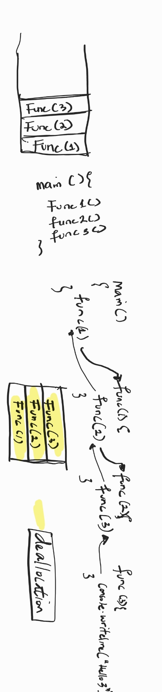

# What is Recursion? 
It is a function that calls itself.

# When do we use Recursion?
To break down bigger problem into smaller problems. Never about the input. 
> 5 -> 4 -> 3 -> 2 -> 1

###Key points
> - smaller problems

> - Visualisation through a recursive tree.

> - Memory usage when we call a function (Recursion stack)

 For every recursive function call, there is a stack generated for it!

We deallocate only when the function call has been successfully done!

> Base Condtion

 Without this, this stack will get FULL and we get *STACKOVERFLOW*

> Recurrence Relation

 Mathematical representation of the recursion 
