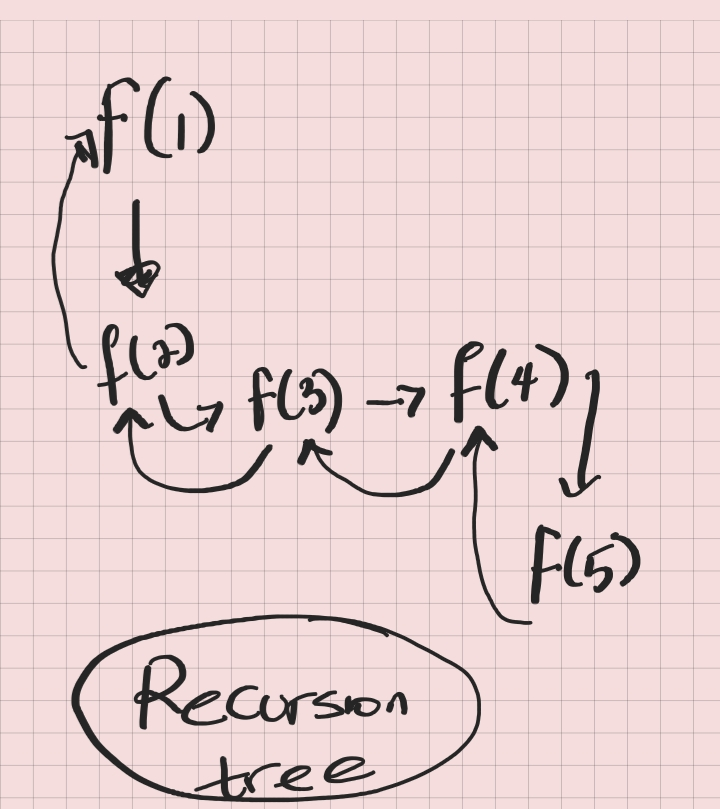

# What is Recursion? 
It is a function that calls itself.

# When do we use Recursion?
To break down bigger problem into smaller problems. Never about the input. 
> 5 -> 4 -> 3 -> 2 -> 1

###Key points
- smaller problems
- Visualisation through a recursive tree.

- Memory usage when we call a function

